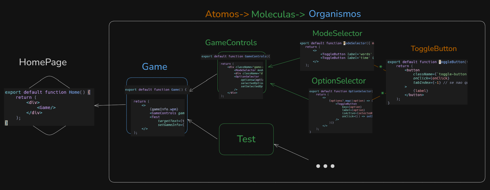

## Passos
MODELS->SERIALIZERS->VIEWS->URLS->FRONTED

## Estrutura

# Divisao de Tarefas

### PAGINAS AMIGOS
- [ ] Procurar e adicionar amigos

- [ ] Ver pedidos de amizade

- [ ] Ver amizades

- [ ] Enviar mensagens amigos e equipa  -> fazer uma componente reutilizavel no react

### PAGINAS EQUIPA
- [ ] Listar equipas disponiveis

- [ ] Procurar uma certa equipa

- [ ] Entrar em equipa

- [ ] ver lista de participantes de uma equipa

### PAGINA COMPETICAO

- [ ] Ver competições disponíveis
  - [x] frontend
  - [x] backend

- [ ] Entrar em competição
  - [x] frontend
  - [x] backend
   
- [ ] LeaderBoard da competição
  - [x] frontend
  - [x] backend

- [ ] Jogar competição
  - [x] frontend
  - [x] backend
  - 
- [ ] Criar competição
  - [ ] frontend
  - [x] backend

### PAGINA PRINCIPAl

- [x] Escolher modo
- [x] Gerar frase
- [ ] Guardar resultados
  - [x] frontend
  - [ ] backend

### PAGINA PERFIL

- [ ] Estatisticas para cada modo de jogo tipo monkeytype

- [ ] Criar um "cartao" com informacoes basicas (como esta no canva)

### PAGINAS DE LOGIN

- [ ] ainda por fazer

### PAGINAS de ADMIN

- [ ] ainda por fazer

### GERAL

- [ ] botao para reportar pessoas

# TODO
> Rapido - dias de trabalho < 2

> Medio -  2 < dias de trabalho < 5

> Lento - 5 < dias de trabalho

## Backend
- [ ] MODELS (rapido)
- [ ] SERIALIZERS (rapido)
- [ ] VIEWS (rapido-medio)

## Frontend
- [ ] Pagina Principal (lento)

- [ ] Pagina Resultado Teste (medio)

- [ ] Pagina Lista Competições individual (rapido)
  - [ ] Pagina competicao individual  (medio)

- [ ] Pagina Lista Equipas (medio-rapido)

- [ ] Pagina Equipa ( medio)
  - [ ] Página Ver Participantes Equipa (medio-rapido)
  - [ ] Pagina competicao equipa (medio)

- [ ] Pagina Lista Amigos (rapido)

- [ ] Pagina Perfil (medio)

- [ ] Pagina Lista liga trofeus(rapido)

