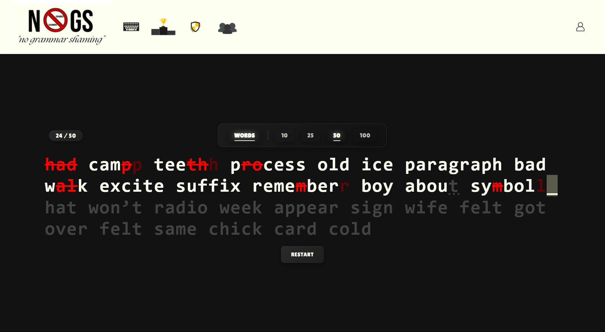
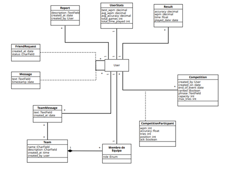

# 🧠 NOGS - Typing Speed Game Platform

## 🚀 Introduction

This project aims to make learning how to type faster on a computer fun and engaging. We've developed a typing game where users can track their statistics and monitor their progress over time.

Since competition is in our DNA, we've added a **Competitions** section where players can challenge each other to see who types faster.

But it’s not just about competition, the **social side** is also key. Users can form teams, make friends, and exchange messages, both individually and within teams.

---

## 💡 Highlights and Innovations

### 🧱 Frontend (React)
- Follows the **Atomic Design** pattern.
- Components are modular, simple, and reusable.
- Code is split into logical subcomponents.

### 🔧 Backend (Django)
- Models and views are organized into separate apps for modularity and clarity.
- Clean, scalable project structure.

### ⌨️ Typing Test Mechanics
- Instead of a typical input field, we use a **global keypress listener** to track user typing.
- Characters are color-coded in real-time, giving immediate feedback on typing accuracy.

### 🔐 Login Cookie Fix
- We encountered cookie issues when using `localhost:3000`.
- Added a redirect from `localhost` to `127.0.0.1` to ensure cookie handling works correctly.

### 🌐 Axios Configuration
- Axios is globally configured in `AuthContext.js` to:
  - Automatically send credentials.
  - Include CSRF tokens.
  - Simplify all backend requests.

### 🛡️ Route Protection
- Direct URLs like `/competition/1` are protected.
- Uses generic routes like `/competitions/` and lets components handle dynamic rendering.
- Unauthorized access redirects users to a **Not Found** or **Access Denied** page.

---

## 🌍 External Resources Used

- **Font**: [Lilita One](https://fonts.googleapis.com/css2?family=Lilita+One&display=swap)
- **Word List**: [1000 Most Common English Words](https://github.com/SMenigat/thousand-most-common-words/blob/master/words/en.json)
- **Date Library**: [Luxon](https://www.npmjs.com/package/luxon) – modern alternative to Moment.js

> All components were built from scratch. AI tools were only used for visual fine-tuning of CSS layouts.

---

## 👤 User Roles

| Role                | Capabilities |
|---------------------|--------------|
| **Unregistered Player** | Can play solo games only |
| **Registered Player**   | Can join competitions, track progress, form teams, send messages |
| **Administrator**       | Can create competitions, moderate users, and use all player features |

---

## ⚙️ Features Overview

| Feature                                      | Unregistered | Registered | Admin |
|---------------------------------------------|--------------|------------|-------|
| Typing games with custom word count         | ✅           | ✅         | ✅    |
| View stats and game history                 | ❌           | ✅         | ✅    |
| Add/remove friends, send private messages   | ❌           | ✅         | ✅    |
| Create and manage teams with hierarchies    | ❌           | ✅         | ✅    |
| Create competitions                         | ❌           | ❌         | ✅    |
| Moderate users and reports                  | ❌           | ❌         | ✅    |

Features can be accessed via the top navigation menu on the platform.

---

## 🧭 Navigation Summary

- Solo games: available to all users.
- Stats, friends, and teams: available to registered users.
- Team chat system for intra-team communication.
- Admins can create competitions and moderate reports/behavior.

---

## 📐 Class Diagram

---

## 📚 References

- Roopal, R. J. (2020). *Atomic Design Pattern: Structuring Your React Application*. [Medium Article](https://rjroopal.medium.com/atomic-design-pattern-structuring-your-react-application-970dd57520f8)
- Google Fonts. *Lilita One*. [Link](https://fonts.googleapis.com/css2?family=Lilita+One&display=swap)
- SMenigat. *Thousand Most Common Words*. [GitHub](https://github.com/SMenigat/thousand-most-common-words/blob/master/words/en.json)
- Luxon Library. [NPM Package](https://www.npmjs.com/package/luxon)

---

## 🎉 Final Notes

This project combines learning, fun, competition, and social interaction in one engaging platform — with a focus on modular design and user experience.

